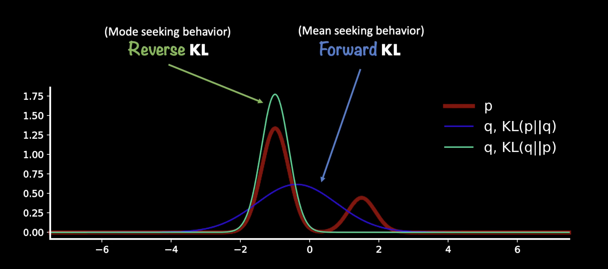
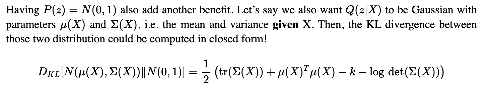

## Objective of VAE

- Compute the **posterior** $p_\theta(z|x)$ which takes data from observation to latent space
    - $\textcolor{red}{p_\theta(z|x)} p_\theta(x) = p_\theta(x,z)$ is the expression for this term!
        - LHS: first term we want to find! second term we can’t find!
        - RHS: gives us the chance of having (observation, latent) pair, describes everything!
- $p_\theta(x) = p(x;\theta)$ = **evidence** = marginal likelihood = true distribution parameterised by $\theta$
- Maximise the evidence $p_\theta(x)$ ⇒ MLE on the true data distribution!

> 💡 Both depend on us evaluating the **evidence/marginal likelihood** $p_\theta(x)$, whose calculation is **intractable**.
Why?
We can try to find evidence by integrating latent variables $z$:

- $p_\theta(x) = \int p_\theta(x|z)p(z) \ dz = \int p_\theta(x,z)\ dz$, require us to integrate over the latent variable, which usually is in a high dimension and can take a large range of values!
- This makes calculation impossible / intractable!
</aside>

## KL-Divergence

- Measures the divergence between two distributions
- Inspired from the difference between log-likelihood (AKA log likelihood ratio)
    - $\log \frac{p_\theta(x)}{q_\theta(x)}$ and we take the mean of this:

$$
D_{KL}(p_\theta(x)||q_\phi(x)) = \int _\R p_\theta(x) \log [\frac{p_\theta(x)}{q_\theta(x)}] \ dx = E_{x \sim p_\theta(x)}[\log \frac{p_\theta(x)}{q_\phi(x)}]
$$

$$
D_{KL}(p_\theta(z|x) || q_\phi(z|x)) = \int _\R p_\theta(z|x) \log [\frac{p_\theta(z|x)}{q_\phi(z|x)}] \ dz = E_{z \sim p_\theta(z|x)}[\log \frac{p_\theta(z|x)}{q_\phi(z|x)}]
$$

> 💡 Notice that the expectation is taken WRT $p_\theta$, the numerator ⇒ this is called **forward KL**

- There are forward, $D_{KL}(p_\theta||q_\phi)$ and reverse, $D_{KL}(q_\phi||p_\theta)$ divergence which gives different optimising result for learnt distribution q:
    
    <!--  -->
    

## Evidence Lower Bound (ELBO)

This method allows us to model the evidence ( denominator of the Baye’s theorem, $p_\theta(x)$ ) with another analysable distribution $q_\phi(x)$. 

Therefore we can also approximate the **posterior distribution (encoder)** with another distribution that is computable, $q_\phi(z|x)$. We will use optimisation techniques to find the computable variable.

**^We assume this can be learnt by the neural network!**

---

The KL definition gives us some meaningful relationships: we can manipulate the equation to find how to best conform to the true distribution using the approximated distribution.

Simplifying this KL term:

$$
D_{KL}(\ q_\phi(z|x) \ || \ p_\theta(z|x)\ ) = E_{z \sim q_\phi(z|x)}[\log q_\phi(z|x)] - E_{z \sim q_\phi(z|x)}[\log p_\theta(z|x)]
$$

$$
D_{KL}(\ q_\phi(z|x) \ || \ p_\theta(z|x)\ )  = E_{z \sim q_\phi(z|x)}[\log q_\phi(z|x)] - E_{z \sim q_\phi(z|x)}[\log p_\theta(z,x) - \log p_\theta(x)]
$$

Note the independence between p and q, hence:

$$
D_{KL}(\ q_\phi(z|x) \ || \ p_\theta(z|x)\ )  = E_{z \sim q_\phi(z|x)}[\log q_\phi(z|x)] - E_{z \sim q_\phi(z|x)}[\log p_\theta(z,x)] + \log p_\theta(x)
$$

As **KL-divergence (LHS) is always non-negative**, the **evidence lower bound** is therefore:

$$
\log p_\theta(x) \geq \textcolor{red}{L_{\text{ELB}}} = - E_{z \sim q_\phi(z|x)}[\log q_\phi(z|x)] + E_{z \sim q_\phi(z|x)}[\log p_\theta(z,x)]
$$

---

This already gives us an equation that allow us to maximise the likelihood. Now, we examine and dissect the equation further to try to understand it:

$$
L_{\text{ELB}} = - E_{q_\phi}[\log q_\phi(z|x)] + E_{q_\phi}[\log p_\theta(z|x) + \log p_\theta(x)]
$$

$$
L_{\text{ELB}} = E_{q_\phi}[\log p_\theta(x)- \log q_\phi(z|x)] + E_{q_\phi}[\log p_\theta(x|z)]
$$

Note that the first term would be a reverse KL, but we can apply negation to get the forward KL:

$$
\color{blue} L_{\text{ELB}} = -D_{KL}(\ q_\phi(z|x) \ || \ p_\theta(x)\ )+ E_{z \sim q_\phi(z|x)}[\log p_\theta(x|z)]
$$

We want to maximise ELBO, which consists of:

- **minimise the negated KL term:** how similar the posterior is to the prior
    - Effectively, this **regularises** the complexity of latent space
    - we usually set the prior to be standard normal distribution, which allow us to get a closed form equation:
        
        
        
- **maximise the likelihood:** how likely to see the observation given this latent
    
    $$
    E_{z \sim q_\phi(z|x)}[\log p_\theta(x|z)] \approx \frac{1}{N} \sum_{i=1}^{N} {q_\phi(z_i|x)}\log p_\theta(x|z_i)
    $$
    
    - Average over the latent variables (approximated by taking N samples from the encoding distribution)
    - Intuitively, this is the same as taking samples of **z = mu * zeta + epsilon** **(sampled from the learnt encoding function),** and calculating the average of the log likelihood
    - Under the assumption of $q$ being a normal distribution, we can use the property that likelihood = MSE + constant
        
        [Where does the Mean Squared Error come from?](https://tivadardanka.com/blog/mean-squared-error-explained)
        

---

By minimising the **negated** ELBO, we are doing two things:

- we minimises the KL-divergence term ⇒ we want posterior distribution to be close to prior
- we minimises the negative log-likelihood ⇒ we want reconstructed x to be similar to x

> 💡 **The reconstruction error can be interpreted as equivalent to negative log-likelihood.**

Maximizing the likelihood of the observed data under the generative model is equivalent to minimizing the negative log-likelihood. Minimizing the negative log-likelihood encourages the model to generate data that closely matches the observed data. 

</aside>

## “Duality” view

Taking the duality view, since:

$\log p_\theta(x) = L_{ELB} + D_{KL}(\ q_\phi(z|x) \ || \ p_\theta(z|x)\ )$

If we are maximising $L_{ELB}$, we are also making sure we are minimising $D_{KL}(\ q_\phi(z|x) \ || \ p_\theta(z|x)\ )$

Which is trying to “match” the approximate distribution to the underlying true distribution!

## Reference

[A Tutorial on Variational Autoencoders with a Concise Keras Implementation | Louis Tiao](https://tiao.io/post/tutorial-on-variational-autoencoders-with-a-concise-keras-implementation/)

[Variational Autoencoder: Intuition and Implementation - Agustinus Kristiadi](https://agustinus.kristia.de/techblog/2016/12/10/variational-autoencoder/)