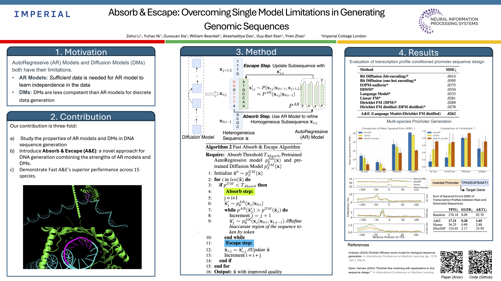

**&commat; Authors** | *Zehui Li, <u>Yuhao Ni</u>, Guoxuan Xia, William Beardall, Akashaditya Das, Guy-Bart Stan, Yiren Zhao*

**&nearr; Full-text** | *[https://arxiv.org/abs/2410.21345](https://arxiv.org/abs/2410.21345)*

<!-- ## Poster

 -->

## Abstract

Abstract Recent advances in immunology and synthetic biology have accelerated the development of deep generative methods for DNA sequence design. Two dominant approaches in this field are AutoRegressive (AR) models and Diffusion Models (DMs). However, genomic sequences are functionally heterogeneous, consisting of multiple connected regions (e.g., Promoter Regions, Exons, and Introns) where elements within each region come from the same probability distribution, but the overall sequence is non-homogeneous. This heterogeneous nature presents challenges for a single model to accurately generate genomic sequences. In this paper, we analyze the properties of AR models and DMs in heterogeneous genomic sequence generation, pointing out crucial limitations in both methods: (i) AR models capture the underlying distribution of data by factorizing and learning the transition probability but fail to capture the global property of DNA sequences. (ii) DMs learn to recover the global distribution but tend to produce errors at the base pair level. To overcome the limitations of both approaches, we propose a post-training sampling method, termed Absorb & Escape (A&E) to perform compositional generation from AR models and DMs. This approach starts with samples generated by DMs and refines the sample quality using an AR model through the alternation of the Absorb and Escape steps. To assess the quality of generated sequences, we conduct extensive experiments on 15 species for conditional and unconditional DNA generation. The experiment results from motif distribution, diversity checks, and genome integration tests unequivocally show that A&E outperforms state-of-the-art AR models and DMs in genomic sequence generation.